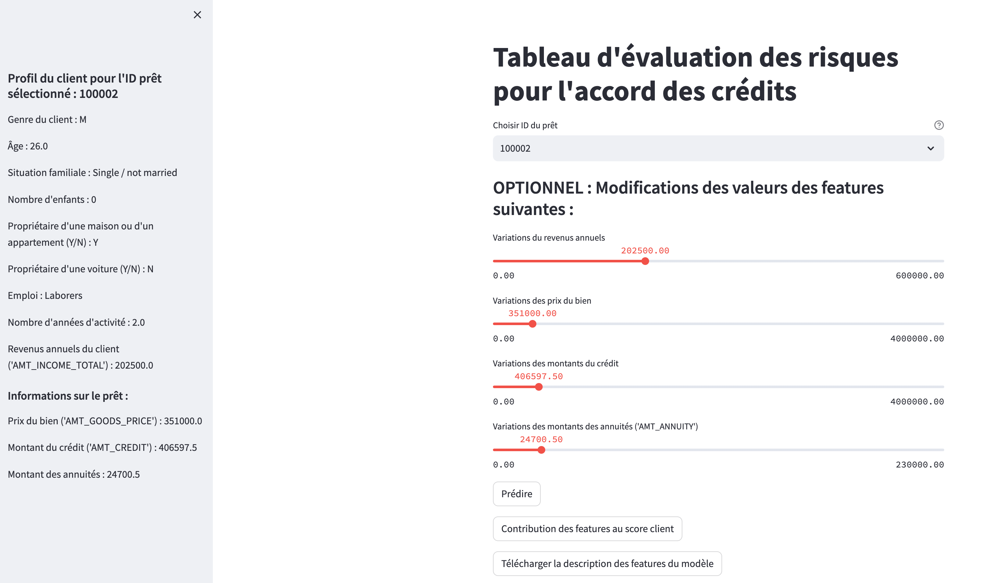
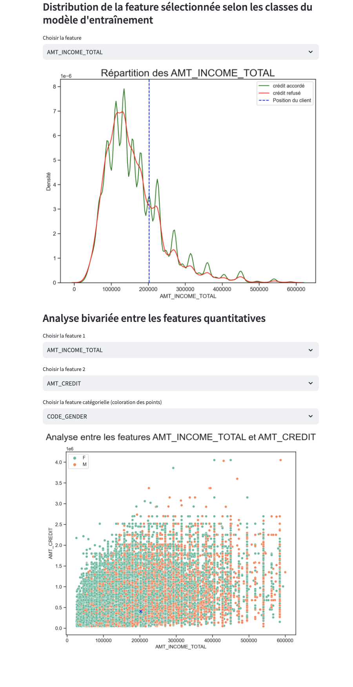

# P7 project : OpenClassRooms subject
Interactive dashboard for the "Prêt à dépenser" company, designed to provide account managers with information on the conditions for granting loans. 

## Files description 
**api folder :** 

main.py created by FastAPI,  one route returns the model's prediction scores for the selected loan ID and another returns the local importance values 

requirements.txt : file with the list of packages used in the API and their version numbers.

sample_call.py : dictionary of an example (loan ID) of values for all the features required for an API response to the prediction request

app.yaml et cloudbuild.yaml : App Engine configuration and deployment files on GCP

tests folder : 
test_api.py : contains unit test files that check the correct operation of the various API functions. 

model.pkl : binary file containing the best trained model recorded using the MLflow library. File only used for local deployment of the API and Dashboard. 

**dashboard folder :**

main.py created by streamlit library. dashboard source code, including the definition of the various visualisations, user interactions and data queries.

scaler.pkl : serialization of standard scaler object used in the data pre-processing step before training the model 

cloudbuild.yaml : App Engine configuration and deployment files on GCP

requirements.txt : file with the list of packages used in the dashboard and their version numbers.

.streamlit folder : streamlit configuration

images : image files displayed in the dashboard

Dockerfile : Docker image definition

**Docs folder : **
contains the project documentation files

Images folder : contains images from the documentation

**notebook folder : **

P7_EDA_FEAT.ipynb : notebook that contains Exploratory Data Analysis, Data preparation.  

P7_MODEL_.ipynb : notebook that contains Baseline model, Improved model, and Model interpretation. 

P7_datadrift.ipynb : notebook that contains Data Drift Analysis. 

## Interactive Dashboard with python - Streamlit : Instructions
### Description
The credit approval risk assessment dashboard is an interactive application created with Streamlit. It enables users to view and analyse a customer's data and loans, providing relevant graphs. It also provides a score to predict the risk of granting a loan. 
This dashboard can be accessed directly from the web, or it can be deployed locally by following the instructions below: 


### Instructions 
1. Prerequisites:

* Make sure you have Python installed on your system.
* Install the required dependencies by running the following command in your terminal:
```sh
pip install -r requirements.txt
```
2. Running the API and the Dashboard:
* Clone the GitHub repository containing the API and Dashboard code using the following command:

```sh
git clone https://github.com/AuHoh/P7
```
* Navigate to the project directory using the command:
```sh
cd P7
```
* Using the console, from the `api/` directory, launch API with the following command:
```shell
python main.py
```

* Using the console, from the `dashboard/` directory, launch Streamlit with the following command:
```shell
streamlit run main.py
```
* Once the server is running, you should see a local link in your terminal (e.g., http://localhost:8000). Click on this link to access the Streamlit dashboard in your browser.

3. Using the Dashboard:

* Upon opening the dashboard, you will see a user-friendly interactive interface where you can choose the loan ID from the drop-down list or type it in directly. 
* In the sidebar, you'll see different information about the customer and the corresponding loan. 
* On the main page, you will be able to make a prediction of the loan approval risk assessment based on the information available in the database and/or, as an option, you can use the variation bars to try to modify some of the loan amounts before making a new prediction. 
* Click on the "predict" button, and you will see the prediction with its metric, and a graph of the top 50 global features importance of the model. The predict button calculates the probability that a customer will repay their loan, and then classifies the application as either granted or refused. The closer the score is to 1, the more certain it is that the customer will have difficulty repaying the loan. 
* Click on the "Feature contribution to customer score" button to calculate the feature importance values specific to the loan ID case.  
* Click on the "Download the description of the model features" button to obtain an Excel table with a description of all the columns in the dataset. 
* Interactive charts display the ability to select features from a drop-down list to see either the distribution of the feature based on whether credit is granted or denied, or to view a bi-variate analysis chart and position the customer value .

If you have any questions or feedback, use the contact details provided in the "Author" section to get in touch with the team responsible for the dashboard. 


### Screenshot






## Author
Audrey Hohmann, OpenclassRoom student : Data Scientist training path
